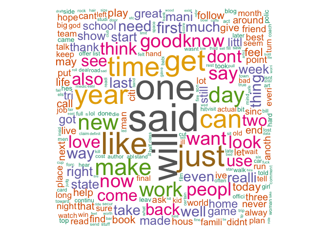

# Capstone Project - Milestone Report
Igor Cizelj, Ph.D.  

# Introduction

This milestone report will be applying data science in the area of natural language processing. The following lines addressing the data extraction, cleaning and text mining of the so called [HC Copora](http://www.corpora.heliohost.org). This report is part of the data science capstone project of [Coursera](https://www.coursera.org) and [Swiftkey](http://swiftkey.com/). The plots, code chunks and remarks will explain the reader the first steps to build a prediction application.


# Data Processing

The data set consists of three files in US English.

### Loading The Dataset 

```r
fileURL <- "http://d396qusza40orc.cloudfront.net/dsscapstone/dataset/Coursera-SwiftKey.zip"
download.file(fileURL, destfile = "Dataset.zip", method = "curl")
unlink(fileURL)
unzip("Dataset.zip")
```


### Aggreagating A Data Sample

In order to enable faster data processing, a data sample from all three sources was generated.


```r
sampleTwitter <- twitter[sample(1:length(twitter),10000)]
sampleNews <- news[sample(1:length(news),10000)]
sampleBlogs <- blogs[sample(1:length(blogs),10000)]
textSample <- c(sampleTwitter,sampleNews,sampleBlogs)
```


# Summary Statistics


The following table provides an overview of the imported data. In addition to the size of each data set, the number of lines and words are displayed. 


File Name            File Size in Megabyte   Line Count   Word Count
------------------  ----------------------  -----------  -----------
Blogs                               200.42       899288     37334147
News                                196.28      1010242     34372530
Twitter                             159.36      2360148     30373603
Aggregated Sample                     2.42        15000        15000


A word cloud usually provides a first overview of the word frequencies. The word cloud displays the data of the aggregated sample file.


```r
trigramTDM <- TermDocumentMatrix(finalCorpus)
wcloud <- as.matrix(trigramTDM)
v <- sort(rowSums(wcloud),decreasing=TRUE)
d <- data.frame(word = names(v),freq=v)
wordcloud(d$word,d$freq,
          c(5,.3),50,
          random.order=FALSE,
          colors=brewer.pal(8, "Dark2"))
```

<!-- -->


# Building A Clean Text Corpus

By using the [tm package](http://tm.r-forge.r-project.org/index.html) the sample data gets *cleaned*. With cleaning it is meant that the text data is converted into lower case, further punction, numbers and URLs are getting removed. Next to that stop and profanity words are erased from the text sample. At the end we are getting a clean text corpus which enables an easy subsequent processing.

The used profanity words can be inspected [in this Github Repository](https://github.com/IgorCizelj/CapstoneCoursera/tree/master/MilestoneReport/profanityfilter.txt).


```r
## Make it work with the new tm package
cleanSample <- tm_map(cleanSample, content_transformer(function(x) iconv(x, to="UTF-8", sub="byte")), 
                      mc.cores=2)
cleanSample <- tm_map(cleanSample, content_transformer(tolower), lazy = TRUE)
cleanSample <- tm_map(cleanSample, content_transformer(removePunctuation))
cleanSample <- tm_map(cleanSample, content_transformer(removeNumbers))
removeURL <- function(x) gsub("http[[:alnum:]]*", "", x) 
cleanSample <- tm_map(cleanSample, content_transformer(removeURL))
cleanSample <- tm_map(cleanSample, stripWhitespace)
cleanSample <- tm_map(cleanSample, removeWords, stopwords("english"))
cleanSample <- tm_map(cleanSample, removeWords, profanityWords)
cleanSample <- tm_map(cleanSample, stemDocument)
cleanSample <- tm_map(cleanSample, stripWhitespace)
```


## The N-Gram Tokenization

In Natural Language Processing (NLP) an *n*-gram is a contiguous sequence of n items from a given sequence of text or speech.

The following function is used to extract 1-grams, 2-grams and 2-grams from the cleaned text corpus.


```r
ngramTokenizer <- function(theCorpus, ngramCount) {
        ngramFunction <- NGramTokenizer(theCorpus, 
                                Weka_control(min = ngramCount, max = ngramCount, 
                                delimiters = " \\r\\n\\t.,;:\"()?!"))
        ngramFunction <- data.frame(table(ngramFunction))
        ngramFunction <- ngramFunction[order(ngramFunction$Freq, 
                                             decreasing = TRUE),][1:10,]
        colnames(ngramFunction) <- c("String","Count")
        ngramFunction
}
```

By the usage of the tokenizer function for the *n*-grams a distribution of the following top 10 words and word combinations can be inspected. Unigrams are single words, while bigrams are two word combinations and trigrams are three word combinations.

### Top Unigrams

```r
unigram <- readRDS("./unigram.RDS")
unigramPlot <- gvisColumnChart(unigram, "String", "Count",                  
                            options=list(legend="none"))

print(unigramPlot, "chart")
```

<!-- ColumnChart generated in R 3.3.2 by googleVis 0.6.1 package -->
<!-- Sat Nov 19 13:47:26 2016 -->


<!-- jsHeader -->
<script type="text/javascript">
 
// jsData 
function gvisDataColumnChartIDa0372be226d () {
var data = new google.visualization.DataTable();
var datajson =
[
 [
"said",
1531
],
[
"one",
1409
],
[
"will",
1390
],
[
"like",
1192
],
[
"just",
1168
],
[
"get",
1129
],
[
"time",
1054
],
[
"year",
1045
],
[
"go",
1005
],
[
"can",
990
] 
];
data.addColumn('string','String');
data.addColumn('number','Count');
data.addRows(datajson);
return(data);
}
 
// jsDrawChart
function drawChartColumnChartIDa0372be226d() {
var data = gvisDataColumnChartIDa0372be226d();
var options = {};
options["allowHtml"] = true;
options["legend"] = "none";

    var chart = new google.visualization.ColumnChart(
    document.getElementById('ColumnChartIDa0372be226d')
    );
    chart.draw(data,options);
    

}
  
 
// jsDisplayChart
(function() {
var pkgs = window.__gvisPackages = window.__gvisPackages || [];
var callbacks = window.__gvisCallbacks = window.__gvisCallbacks || [];
var chartid = "corechart";
  
// Manually see if chartid is in pkgs (not all browsers support Array.indexOf)
var i, newPackage = true;
for (i = 0; newPackage && i < pkgs.length; i++) {
if (pkgs[i] === chartid)
newPackage = false;
}
if (newPackage)
  pkgs.push(chartid);
  
// Add the drawChart function to the global list of callbacks
callbacks.push(drawChartColumnChartIDa0372be226d);
})();
function displayChartColumnChartIDa0372be226d() {
  var pkgs = window.__gvisPackages = window.__gvisPackages || [];
  var callbacks = window.__gvisCallbacks = window.__gvisCallbacks || [];
  window.clearTimeout(window.__gvisLoad);
  // The timeout is set to 100 because otherwise the container div we are
  // targeting might not be part of the document yet
  window.__gvisLoad = setTimeout(function() {
  var pkgCount = pkgs.length;
  google.load("visualization", "1", { packages:pkgs, callback: function() {
  if (pkgCount != pkgs.length) {
  // Race condition where another setTimeout call snuck in after us; if
  // that call added a package, we must not shift its callback
  return;
}
while (callbacks.length > 0)
callbacks.shift()();
} });
}, 100);
}
 
// jsFooter
</script>
 
<!-- jsChart -->  
<script type="text/javascript" src="https://www.google.com/jsapi?callback=displayChartColumnChartIDa0372be226d"></script>
 
<!-- divChart -->
  
<div id="ColumnChartIDa0372be226d" 
  style="width: 500; height: automatic;">
</div>

### Top Bigrams

```r
bigram <- readRDS("./bigram.RDS")
bigramPlot <- gvisColumnChart(bigram, "String", "Count",                  
                            options=list(legend="none"))

print(bigramPlot, "chart")
```

<!-- ColumnChart generated in R 3.3.2 by googleVis 0.6.1 package -->
<!-- Sat Nov 19 13:47:27 2016 -->


<!-- jsHeader -->
<script type="text/javascript">
 
// jsData 
function gvisDataColumnChartIDa033f00e9a2 () {
var data = new google.visualization.DataTable();
var datajson =
[
 [
"last year",
97
],
[
"new york",
90
],
[
"right now",
81
],
[
"look like",
80
],
[
"year ago",
80
],
[
"dont know",
69
],
[
"last week",
67
],
[
"high school",
59
],
[
"feel like",
57
],
[
"first time",
55
] 
];
data.addColumn('string','String');
data.addColumn('number','Count');
data.addRows(datajson);
return(data);
}
 
// jsDrawChart
function drawChartColumnChartIDa033f00e9a2() {
var data = gvisDataColumnChartIDa033f00e9a2();
var options = {};
options["allowHtml"] = true;
options["legend"] = "none";

    var chart = new google.visualization.ColumnChart(
    document.getElementById('ColumnChartIDa033f00e9a2')
    );
    chart.draw(data,options);
    

}
  
 
// jsDisplayChart
(function() {
var pkgs = window.__gvisPackages = window.__gvisPackages || [];
var callbacks = window.__gvisCallbacks = window.__gvisCallbacks || [];
var chartid = "corechart";
  
// Manually see if chartid is in pkgs (not all browsers support Array.indexOf)
var i, newPackage = true;
for (i = 0; newPackage && i < pkgs.length; i++) {
if (pkgs[i] === chartid)
newPackage = false;
}
if (newPackage)
  pkgs.push(chartid);
  
// Add the drawChart function to the global list of callbacks
callbacks.push(drawChartColumnChartIDa033f00e9a2);
})();
function displayChartColumnChartIDa033f00e9a2() {
  var pkgs = window.__gvisPackages = window.__gvisPackages || [];
  var callbacks = window.__gvisCallbacks = window.__gvisCallbacks || [];
  window.clearTimeout(window.__gvisLoad);
  // The timeout is set to 100 because otherwise the container div we are
  // targeting might not be part of the document yet
  window.__gvisLoad = setTimeout(function() {
  var pkgCount = pkgs.length;
  google.load("visualization", "1", { packages:pkgs, callback: function() {
  if (pkgCount != pkgs.length) {
  // Race condition where another setTimeout call snuck in after us; if
  // that call added a package, we must not shift its callback
  return;
}
while (callbacks.length > 0)
callbacks.shift()();
} });
}, 100);
}
 
// jsFooter
</script>
 
<!-- jsChart -->  
<script type="text/javascript" src="https://www.google.com/jsapi?callback=displayChartColumnChartIDa033f00e9a2"></script>
 
<!-- divChart -->
  
<div id="ColumnChartIDa033f00e9a2" 
  style="width: 500; height: automatic;">
</div>

### Top Trigrams

```r
trigram <- readRDS("./trigram.RDS")
trigramPlot <- gvisColumnChart(trigram, "String", "Count",                  
                            options=list(legend="none"))

print(trigramPlot, "chart")
```

<!-- ColumnChart generated in R 3.3.2 by googleVis 0.6.1 package -->
<!-- Sat Nov 19 13:47:27 2016 -->


<!-- jsHeader -->
<script type="text/javascript">
 
// jsData 
function gvisDataColumnChartIDa037a80353f () {
var data = new google.visualization.DataTable();
var datajson =
[
 [
"let us know",
10
],
[
"presid barack obama",
10
],
[
"cant wait see",
8
],
[
"new york citi",
8
],
[
"happi mother day",
7
],
[
"osama bin laden",
7
],
[
"two year ago",
7
],
[
"dont even know",
6
],
[
"execut order issu",
6
],
[
"ive ever seen",
6
] 
];
data.addColumn('string','String');
data.addColumn('number','Count');
data.addRows(datajson);
return(data);
}
 
// jsDrawChart
function drawChartColumnChartIDa037a80353f() {
var data = gvisDataColumnChartIDa037a80353f();
var options = {};
options["allowHtml"] = true;
options["legend"] = "none";

    var chart = new google.visualization.ColumnChart(
    document.getElementById('ColumnChartIDa037a80353f')
    );
    chart.draw(data,options);
    

}
  
 
// jsDisplayChart
(function() {
var pkgs = window.__gvisPackages = window.__gvisPackages || [];
var callbacks = window.__gvisCallbacks = window.__gvisCallbacks || [];
var chartid = "corechart";
  
// Manually see if chartid is in pkgs (not all browsers support Array.indexOf)
var i, newPackage = true;
for (i = 0; newPackage && i < pkgs.length; i++) {
if (pkgs[i] === chartid)
newPackage = false;
}
if (newPackage)
  pkgs.push(chartid);
  
// Add the drawChart function to the global list of callbacks
callbacks.push(drawChartColumnChartIDa037a80353f);
})();
function displayChartColumnChartIDa037a80353f() {
  var pkgs = window.__gvisPackages = window.__gvisPackages || [];
  var callbacks = window.__gvisCallbacks = window.__gvisCallbacks || [];
  window.clearTimeout(window.__gvisLoad);
  // The timeout is set to 100 because otherwise the container div we are
  // targeting might not be part of the document yet
  window.__gvisLoad = setTimeout(function() {
  var pkgCount = pkgs.length;
  google.load("visualization", "1", { packages:pkgs, callback: function() {
  if (pkgCount != pkgs.length) {
  // Race condition where another setTimeout call snuck in after us; if
  // that call added a package, we must not shift its callback
  return;
}
while (callbacks.length > 0)
callbacks.shift()();
} });
}, 100);
}
 
// jsFooter
</script>
 
<!-- jsChart -->  
<script type="text/javascript" src="https://www.google.com/jsapi?callback=displayChartColumnChartIDa037a80353f"></script>
 
<!-- divChart -->
  
<div id="ColumnChartIDa037a80353f" 
  style="width: 500; height: automatic;">
</div>


# Interesting Findings

+ Loading the dataset costs a lot of time. The processing is time consuming because of the huge file size of the dataset. By avoiding endless runtimes of the code, it was indispensable to create a data sample for text mining and tokenization. Nedless to say, this workaround decreases the accuracy for the subsequent predictions.

+ Removing all stopwords from the corpus is recommended, but, of course, stopwords are a fundamental part of languages. Therefore, consideration should be given to include these stop words in the prediction application again.

+ The text mining algorithm needs to be adjusted, so to speak a kind of fine-tuning. As seen in the chart of the top trigrams some words severely curtailed. For example, the second most common trigram is *presid barack obama* instead of *president barack obama*.

# Next Steps For The Prediction Application

As already noted, the next step of the capstone project will be to create a prediction application. 
To create a smooth and fast application it is absolutely necessary to build a fast prediction algorithm. This is also means, I need to find ways for a faster processing of larger datasets. Next to that,  increasing the value of n for n-gram tokenization will improve the prediction accuracy. All in all a shiny application will be created which will be able to predict the next word a user wants to write.

# All Used Code Scripts

All used code snippets to generate this report can be viewed in this [repository](https://github.com/IgorCizelj/CapstoneCoursera/tree/master/MilestoneReport).

# Session Informations

```r
sessionInfo()
```

```
## R version 3.3.2 (2016-10-31)
## Platform: x86_64-apple-darwin13.4.0 (64-bit)
## Running under: OS X Yosemite 10.10.4
## 
## locale:
## [1] en_US.UTF-8/en_US.UTF-8/en_US.UTF-8/C/en_US.UTF-8/en_US.UTF-8
## 
## attached base packages:
## [1] stats     graphics  grDevices utils     datasets  methods   base     
## 
## other attached packages:
##  [1] googleVis_0.6.1        stringi_1.1.2          DT_0.2                
##  [4] stringr_1.1.0          wordcloud_2.5          rJava_0.9-8           
##  [7] slam_0.1-39            SnowballC_0.5.1        tm_0.6-2              
## [10] NLP_0.1-9              qdap_2.2.5             RColorBrewer_1.1-2    
## [13] qdapTools_1.3.1        qdapRegex_0.6.0        qdapDictionaries_1.0.6
## [16] RWekajars_3.9.0-1     
## 
## loaded via a namespace (and not attached):
##  [1] gtools_3.5.0        venneuler_1.1-0     reshape2_1.4.2     
##  [4] reports_0.1.4       colorspace_1.3-1    htmltools_0.3.5    
##  [7] yaml_2.1.13         chron_2.3-47        XML_3.98-1.5       
## [10] DBI_0.5-1           plyr_1.8.4          munsell_0.4.3      
## [13] gtable_0.2.0        htmlwidgets_0.8     codetools_0.2-15   
## [16] evaluate_0.10       knitr_1.14          gender_0.5.1       
## [19] parallel_3.3.2      xlsxjars_0.6.1      highr_0.6          
## [22] Rcpp_0.12.7         scales_0.4.1        formatR_1.4        
## [25] gdata_2.17.0        plotrix_3.6-3       xlsx_0.5.7         
## [28] jsonlite_1.1        openNLPdata_1.5.3-2 gridExtra_2.2.1    
## [31] ggplot2_2.2.0       digest_0.6.10       dplyr_0.5.0        
## [34] grid_3.3.2          tools_3.3.2         bitops_1.0-6       
## [37] magrittr_1.5        lazyeval_0.2.0      RCurl_1.95-4.8     
## [40] tibble_1.2          data.table_1.9.6    assertthat_0.1     
## [43] rmarkdown_1.1       openNLP_0.2-6       R6_2.2.0           
## [46] igraph_1.0.1
```


